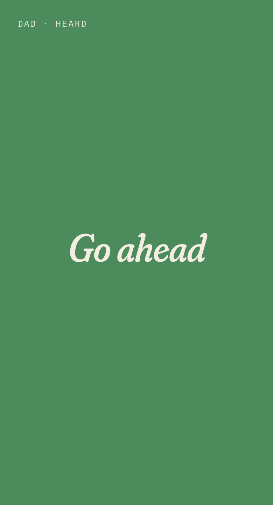
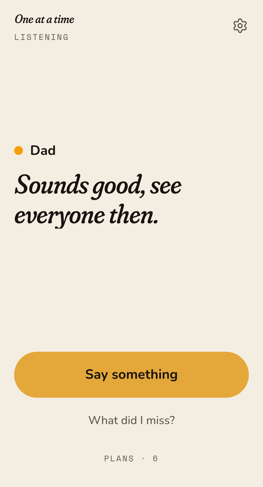
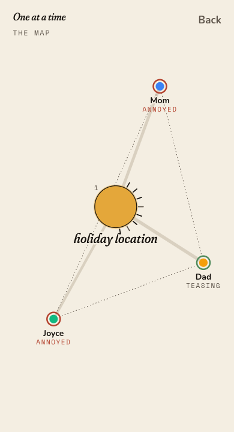
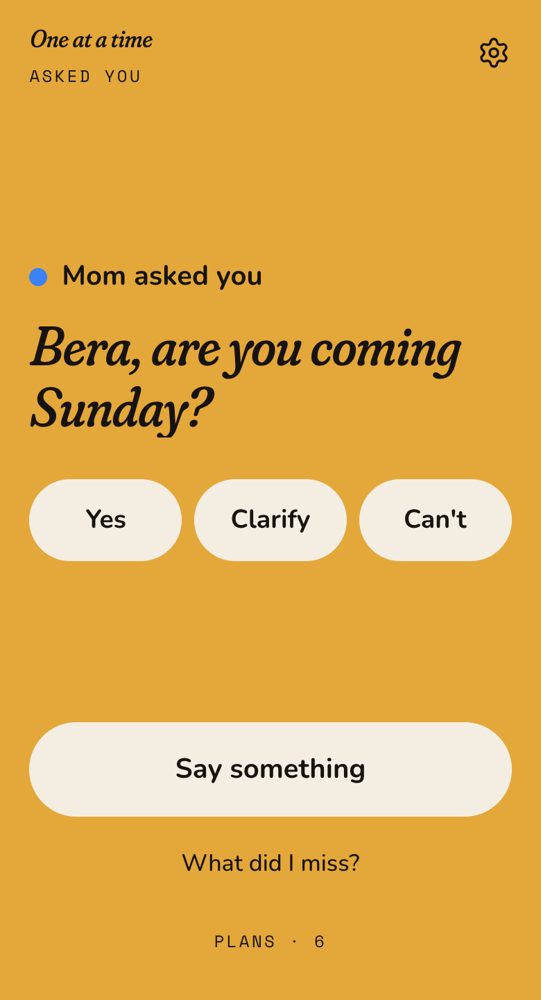

<!-- _class: title -->

BAINSA Hackathon 2026

# One at a time.

The first accessibility tool for the hearing side of the table.

Team · [Name] · [Name] · [Name] · [Name]Milan · 2026

<!--
Presenter hands a judge the listener phone.
"Every accessibility tool puts the burden on the deaf person. We built the other side. Hold this."
Fallback: ?replay=demo2 reproduces the exact same cards without a key or mic.
-->

---

The flip

## Every tool puts the work on the person who can't hear.

They read faster, ask again, and get told “never mind.” Nobody asks the table to change anything. The people talking never find out they lost someone. <b>We built the tool for the table.</b>

“I've started just nodding along even when I have no idea what was decided. My boss mentioned something about a new client project last Thursday and I smiled and agreed but I genuinely don't know what I signed up for.”

r/deaf · 35↑ 5

“DTS - Dinner Table Syndrome. Deaf people in hearing families are too familiar with this, myself included. It's simply too much work to follow along. Thats why you feel like you could sleep for a week, we have to work much harder than a hearing person to understand verbal conversations.”

r/deaf · family Sunday lunch thread, 36↑ 6

---

The numbers

## Where they most want to hear is home.

50M

people in the EU report trouble hearing. About <strong>1 in 9</strong>.1

56% vs 21%

The <strong>family table</strong> is the #1 place they want to hear. Work: 21%. EuroTrak Italy 2022.2

170 wpm

Caption comprehension collapses above it. Group speech runs <strong>160–220</strong>.3

4%

of sampled videos caption non-speech sound: the laugh, the tone.4

Hard-of-hearing and late-deafened adults · EU27 figure derived from the 59M Europe total · sources on the last slide

---

The table

<figure>

Lamp · Go ahead / One at a time

their phone

</figure>
<figure>

Listener · one sentence · Mom · teasing

your phone

</figure>
<figure>

Map · who, to whom, about what

where it went

</figure>

---

What the listener gets back

## One sentence, and what a voice carries.

WhoEvery line named. The phones are the mics.

How it was saidTone in 0.7 s: <i>warm, teasing, annoyed.</i>

What was agreedPlans with the reason, refreshed every 10 s.

When they laughed“The table laughed.” No audio model.

Your name is called: the whole phone turns amber in under 1 s.

---

What's new, honestly

## Everyone else builds for the listener.

<table>
<tr><th>Tool</th><th>Already does</th><th>Doesn't do</th></tr>
<tr><td><strong>Ava</strong></td><td>Phones as named mics, for captions</td><td>Never sends pace or overlap back to the speakers' own phones</td></tr>
<tr><td><strong>Otter / Zoom</strong></td><td>Summarize the conversation</td><td>Only after it's over</td></tr>
<tr><td><strong>Caption glasses</strong></td><td>Words in front of the listener's eyes</td><td>Put more on the deaf person, nothing the table can act on</td></tr>
<tr class="us"><td><strong>One at a time</strong></td><td>Phones as mics, like Ava</td><td>Amber on the talkers' phones. One sentence, one tap, back to the table.</td></tr>
</table>

Ava does the mics. We do the other side of the table.

---

Scope · limits · next

## What this is, and isn't.

ForHard-of-hearing and late-deafened adults in hearing rooms.

Not forSign-first Deaf users.

TestedNot yet tested with a hard-of-hearing user.

Reach~10M in the EU could use it. Tonight it reaches a table.

LanguagesItalian and Turkish verified, plus English.

NextUser tests with hard-of-hearing people. A real voice on the phones (ElevenLabs slot). Look-away catch-up is already built.

Sources

<ol>
<li>AEA / EFHOH / EHIMA, <i>Getting the numbers right on hearing loss in Europe</i>, 2024. 59M Europe; EU27 ≈50M is our arithmetic. ehima.com/wp-content/uploads/2024/03/Getting-the-numbers-right-on-Hearing-Loss-Hearing-Care-and-Hearing-Aid-Use-in-Europe-2024.pdf</li>
<li>EHIMA / Anovum, <i>EuroTrak Italy 2022</i>, p. 60. ehima.com/wp-content/uploads/2022/11/EuroTrak_Italy_2022.pdf</li>
<li>Caption reading speed vs. conversational pace: synthesis of captioning-speed studies (research/05-numbers-for-pitch.md); not a single primary source.</li>
<li>Non-speech information in captions, PMC7040021; May et al., 2025. pmc.ncbi.nlm.nih.gov/articles/PMC7040021/</li>
<li>r/deaf, “Anyone else struggling with group conversations at work…” (35↑). reddit.com/r/deaf/comments/1r2797f/</li>
<li>r/deaf, “Exhausted and sad after family Sunday lunch” (36↑). reddit.com/r/deaf/comments/1fh8h7h/</li>
</ol>

